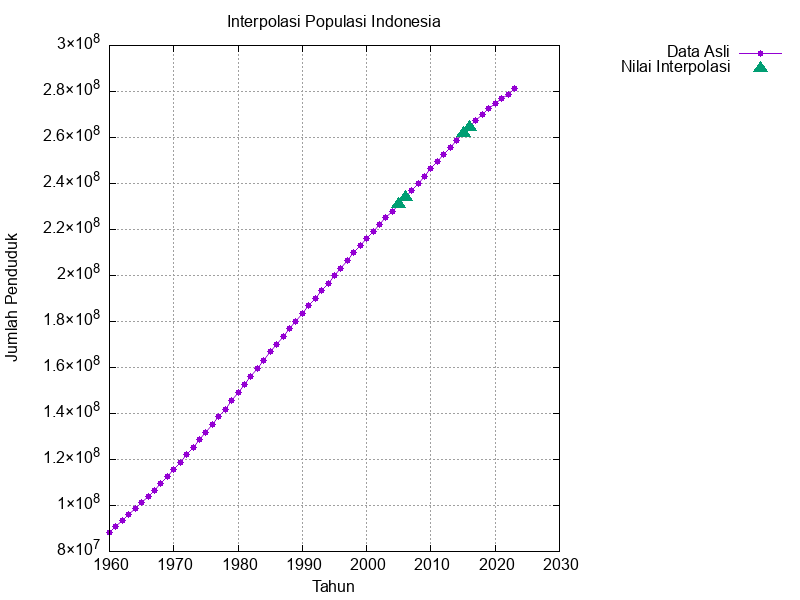
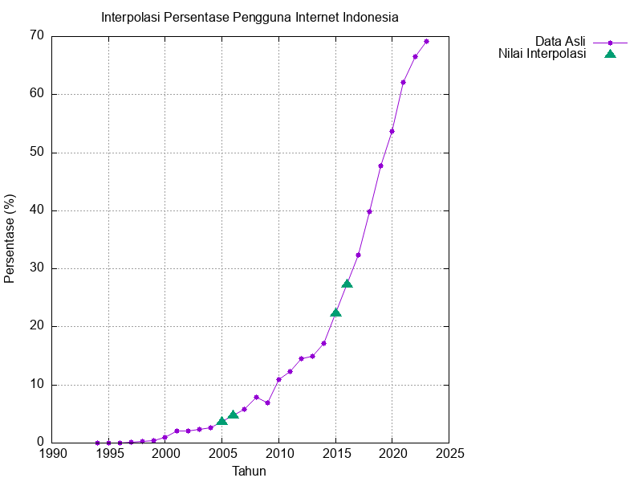
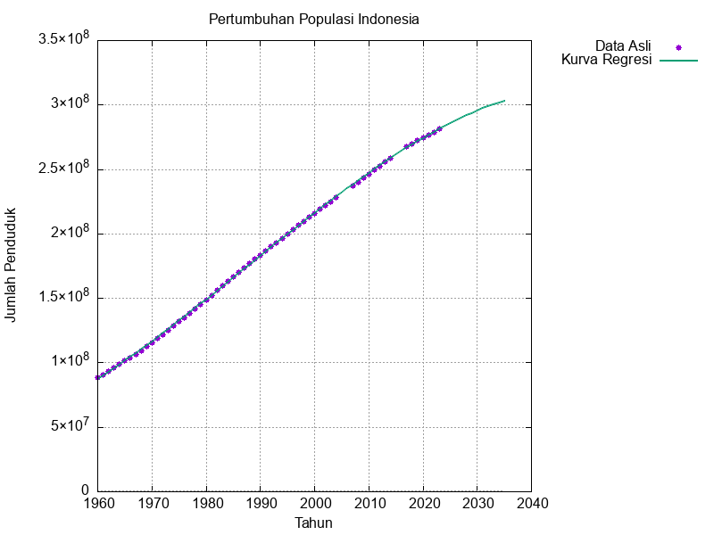
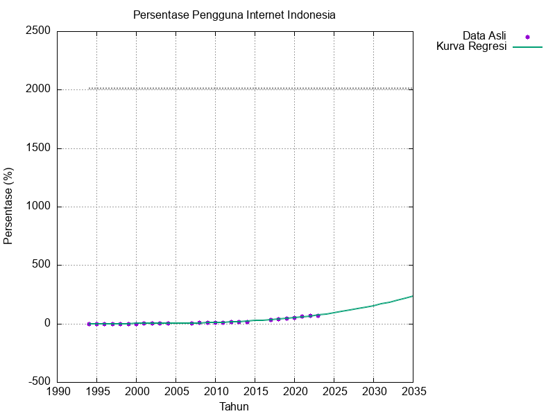

# Program .C Interpolasi dan Regresi Data Penduduk dan Pengguna Internet Indonesia

## Anggota Kelompok 10

- Alexander Christian (2306267025)
- Daffa Sayra Firdaus (2306267151)
- Fathan Yazid Satriani (2306250560) 

---
Program ini menganalisis data penduduk dan persentase pengguna internet di Indonesia dari tahun 1960 hingga 2023. Program melakukan interpolasi untuk mengestimasi nilai yang hilang dan regresi polinomial untuk memprediksi nilai di masa depan.

## Hasil Analisis

HASIL ESTIMASI NILAI YANG HILANG (INTERPOLASI)

1. Estimasi Jumlah Penduduk Indonesia:
   - 2005: 230971878 jiwa (interpolasi antara 2004 dan 2007)
   - 2006: 234017108 jiwa (interpolasi antara 2004 dan 2007)
   - 2015: 261700485 jiwa (interpolasi antara 2014 dan 2017)
   - 2016: 264523572 jiwa (interpolasi antara 2014 dan 2017)

2. Estimasi Persentase Pengguna Internet Indonesia:
   - 2005: 3.6623% (interpolasi antara 2004 dan 2007)
   - 2006: 4.7243% (interpolasi antara 2004 dan 2007)
   - 2015: 22.2074% (interpolasi antara 2014 dan 2017)
   - 2016: 27.2716% (interpolasi antara 2014 dan 2017)

PERSAMAAN POLINOMIAL (UNTUK ESTIMASI MASA DEPAN)

1. Persamaan untuk Pertumbuhan Populasi Indonesia:
   - y = 87172094.457997 + 2716701.135408(Year - 1960)^1 + 24669.141827(Year - 1960)^2 - 299.811689(Year - 1960)^3
   - R^2 = 0.999879

2. Persamaan untuk Persentase Pengguna Internet Indonesia:
   - y = -263.972543 + 20.457447(Year - 1960)^1 - 0.530709(Year - 1960)^2 + 0.004622(Year - 1960)^3
   - R^2 = 0.993636

ESTIMASI MASA DEPAN

1. Estimasi Jumlah Penduduk Indonesia tahun 2030:
   - 295384560 jiwa

2. Estimasi Jumlah Pengguna Internet Indonesia tahun 2035:
   - Persentase (uncapped): 235.0873%
   - Persentase (capped): 100.0000%
   - Populasi: 303205546 jiwa
   - Jumlah Pengguna Internet: 303205546 jiwa

## Visualisasi

### Interpolasi Populasi Indonesia

### Interpolasi Persentase Pengguna Internet Indonesia

### Regresi Pertumbuhan Populasi Indonesia

### Regresi Persentase Pengguna Internet Indonesia

